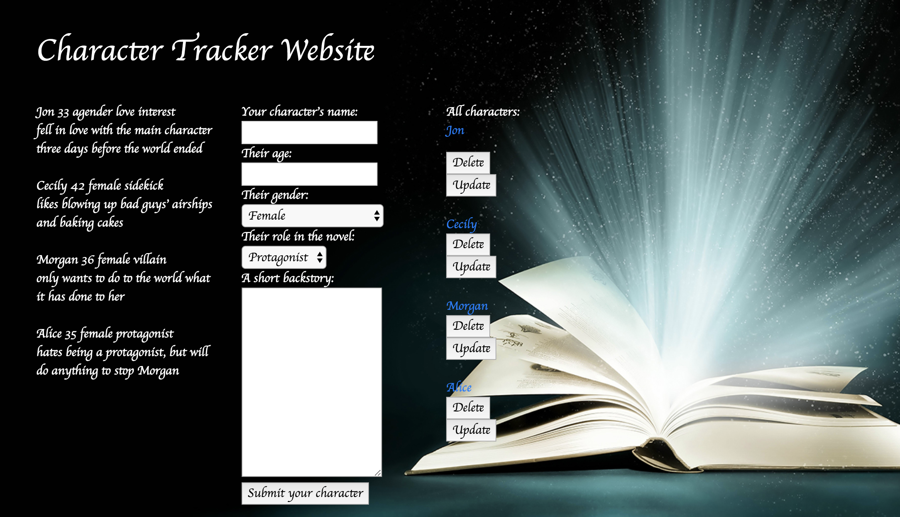

# MVC Crud Project (11/2017)

<h2>Character Tracker Website</h2>
<h4>Rosanne Ussery</h4>

For this project, I used Java, Spring, Gradle, JSP files, HTML and CSS. The project's objectives were to create a CRUD website where the user can view, update, create, and delete information. Interfacing with a database, the information should be stored there and be retrievable by the website.

The website is intended to be used by writers for tracking and updating character information for their stories. As such, it has forms for basic character information such as name, age, gender, role in the novel and room for a short backstory.

As of 11/21/17, the program is no longer returing errors. However, the update functionality is still broken. When compared to similar programs, there is no discernible difference between this program and those. I will continue to investigate. 

In order to use the website, load the page and determine which information you would like to enter for your character. 

Instructions for using the website are as follows:

* Navigate to the url below to access the website.
* Enter information for your character, making sure to fill out the entire form. Failing to enter information in any of the five categories will result in an error. 
* Press the button to submit your information. Your new character entry will be displayed on the left under the template characters.
* Any character's information may be updated. In order to do so, simply click the update navigation button beneath the character's name that you wish to modify. 
* Any character can be deleted from the website. Be sure you intend to do this before clicking the button as the decision is irreversible. 

Known issues to fix (11.19.17):
Update does not update the database/character.

Future Feature sets to add:
Better interface 
Larger textbox for backstory entry on update page 
Error messages for missing information 
Logins for users so they can easily return to their project information 
Functionality for users to create novel sets so they can organize characters by projects 

